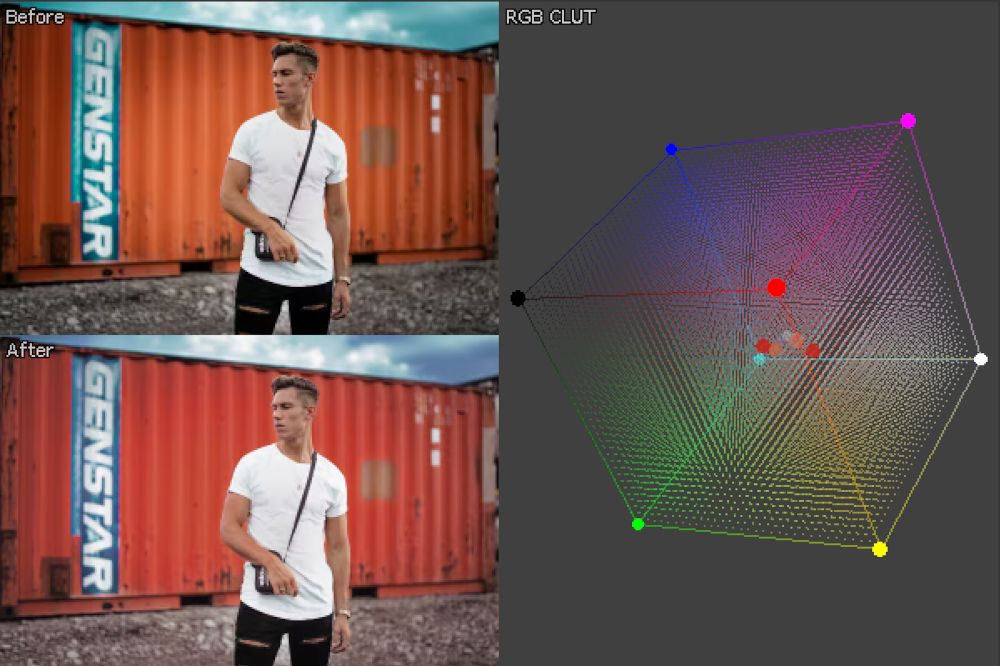

 
   

 
 

# Manipulating Colors and Lighting with VAEs

By using Variational Autoencoders, Stability AI has made working with generative AI much easier. These autoencoders compress images into small (28 x 28 x 28 x 8) vectors that can be easily stored and processed on servers and standard GPUs. The compressed space is more organized than the original, meaning that when these vectors are manipulated with other algorithms, the resulting images will be coherent. For example, a minor distortion in the compressed space will result in a hairstyle change in the original image space.

A big disadvantage of this scheme is that the encoded representations can't be decoded perfectly back into the originals. The "phase" of the image, a term I loosely use here to describe the shape and details, will be distorted. This is why AI art often contains "messed up faces". Below is an encoded and decoded image of a barista. Clearly, the decoded image is unusable. Also, the the fact that our VAE can only encode/decode small images (244 x 244) seems to negate its use in actual image enhancement pipelines.

 

 

What if we only want to change the colors and lighting of our image instead of altering its "phase"? In the graphics and film industries, "Look Up Tables" are commonly used to adjust colors in images by mapping old colors to new ones. These tables are small in size (33 x 33 x 33 x 3) and can be applied to images of any resolution. You can follow this logic in reverse: if you want to learn a color and exposure mapping that "fixes" a high-resolution image, you shouldn't need to use the original full-sized image to obtain this mapping.                                    
     
     
## Project Structure

In this blog post, I discuss the challenge of removing intense colored lighting from images, which cannot be done by simple "white balance" algorithms. While the abstract above advertises the use of Variational Autoencoders, the real difficulty was creating an image dataset that accurately portrayed these distortions. The post is divided into three parts for clarity.

[Part 1](https://messy-bytes.github.io/Advanced-ML-Color-Fixes/2023/04/29/P1.html): In this introduction, I will explain the problem's scope and the challenging color and lighting distortions that are hard to eliminate even with Photoshop tools. My main results gallery is here.

[Part 2](https://messy-bytes.github.io/Advanced-ML-Color-Fixes/2023/05/03/P2.html): This section covers dataset curation with 1D and 3D LUTs, and describes the limitations of generating a distortion dataset "randomly". It also includes a tutorial on how to create 3D LUTs using GIMP that can be applied to any image you like. There are probably radiometric and colorimetric distortions you'd like to be able to neutralize that aren't covered here, and learning how to build custom 3D LUTs is a good step forward for solving those problems.

 

 

 

[Part 3](https://messy-bytes.github.io/Advanced-ML-Color-Fixes/2023/05/05/P3.html): This last section covers the actual machine learning involved, and the other parts of the denoising algorithm. Most of it is intuitive, but there seem to be some advantages of working in a latent space when it comes to "recursively applying" image filters. I've tried my best to explain why this works so well, but at the end of the day I can only guess.

 

  

 
     
### This project assumes that...

*   You have a strong understanding of basic color theory, including HSV coordinates, as well as basic white balance concepts (the gray world algorithm)
*   You're comfortable with pytorch and fully convolutional neural networks, and you've at least heard of GANs 
*   You're familiar with variational autoencoders, the latent space, and programming with the HuggingFace diffusers library. If not, then you've heard of them, and you'd like to learn more

Although it does not assume you know GIMP, I suggest you download it (for free) and try it out! It will get you through most of your image data needs when you don't feel like writing an entire python script to do something.
     
     

