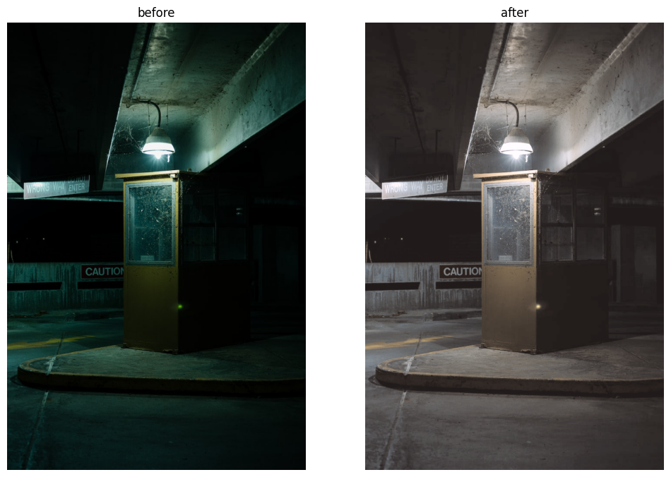
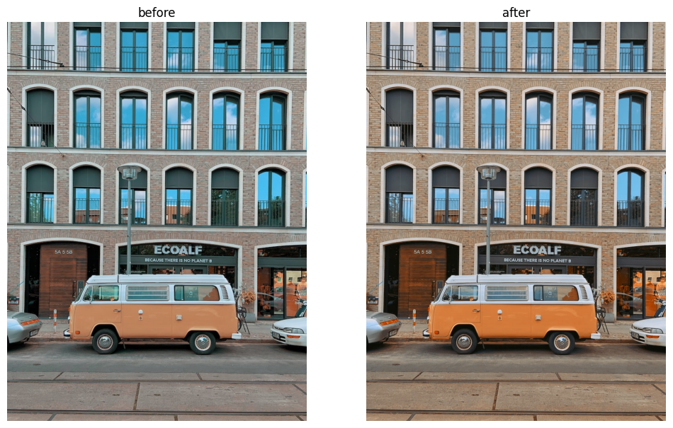

### [Author: John (Jack) Messerly](https://www.linkedin.com/in/jack-messerly-567b9b96/)

 
   

 
 

# Summary

The goal of "color balance" is to fix images with poor color quality, which in the classic case is caused by the ambient lighting in the scene being "colored" or non-neutral, such as if you took a photo in a parking garage with harsh fluorescent lighting. The optimal image color/lighting is usually defined as what colors should be there under perfectly white light. An image that has been tuned with this goal in mind is said to be "white balanced". However, the "best" color adjustment for an image is ultimately rooted in preference and human psychology, and modern color adjustment often includes steps to enhance the colors in the image beyond white balance. For example, we prefer faces to appear warm in photos, no matter what the lighting is. 

The line between "color balance" and "image enhancement" is a little blurred, and data-oriented machine learning approaches solve both at the same time: you adjust pixels of the "bad image" to match the colors in "pleasant" images you have trained on. One of the more common ML common algorithms to fix colored lighthing is to use a fully convolutional network (FCN) to directly regress new colors, i.e. you train a network to take a block of distorted pixels, and regress the new ones. This does work, but it has a few big downsides that I've found make it annoying to use in practice:

1. You can lose details about the edges, textures and general shape of the image, and the resolution of your training images versus test images has a strong impact on this
2. The network can re-color two different parts of an image in unexpected ways when you'd expect it to recolor them similarly, i.e. the coloring isn't enforced to be regular
3. If your images are large, training is very slow and inefficient

However, when we play around with colors we don't usually want to tediously re-color every single pixel in the new image. We usually just want to change the *distribution* of colors, such that we build a table that maps old colors into new ones. New tools from AI art can help us do this. Pictured above is an example of how this works: the color distribution is "extracted" from an image using a variational autoencoder, which converts the original image into a latent representation of a fixed size. A network is trained to "re-color" this latent representation (using KL divergence) into a new latent representation with a more desirable color scheme. This new representation is not decoded into a new output image: it is sampled with a second network that learns a color mapping (old color -> new color), which is then applied to the original image, so that textures and edges are perfectly preserved. The advantages of doing a "re-coloring" this way help alleviate the three problems above:

1. Because you are simply learning a color remapping (old color -> new color), and then applying it to your original image, you do not run the risk of destroying edges and textures
2. Learning to map one color distribution to another helps ensure that your entire recoloring is regular, i.e. you won't unexpectedly recolor two "red" parts of an image to different colors, which is possible if you tried to directly regress a recoloring
3. Because the latent representations are small (and of fixed size), training is very fast, and the resolution of your input image does not matter much

 

# About the author

I developed this ML algorithm on my spare time to help my dad re-color some of the film photographs he took on a trip to Patagonia. Some of these photos are available at the bottom of this page. I've worked as a professional computational photography engineer in the past, and was already familar with the literature here, but am aware of its practical / obnoxious limitations. This blog post is mostly to document my methodology in solving this problem. I didn't write this up very formally, but I thought the results were pretty good, and I wanted to share it somehow. Some of the post is dedicated to algorithm description, but a majority is about crafting datasets in more interesting ways than what's done in academic papers, which is mostly using python scripts to distort images. I did some literature review before writing this, and at the time of publishing, what I did appears novel (not to say this is the most challenging/pressing ML problem out there, which it definitely isn't). I did find one interesting paper during my literature review that I recommend anyone with an ML background take a look at (*Learning Image-adaptive 3D Lookup Tables for High Performance Photo Enhancement in Real-time*). Not totally related to what I did here, but I liked it, tried it out and it seems really interesting for future work in areas completely unrelated to color balance. I do expect the reader to have a background in the following:

1. Color representation, color balance and computational photography (RGB vs HSV)
2. Basic ML (CNNs)
3. Advanced statistics (latent spaces, variational auto-encoders)

I do not expect familiarity with generative machine learning or AI art, but this blog post does introduce some of those tools, which are surprisingly really easy and fun to use. If you haven't looked at HuggingFace's networks, they are really easy to pick up and use (it isn't like learning a second pytorch).

 
 

# HuggingFace's toolbox

Autoencoders, and their fancier cousin, the Variational Autoencoder, are just data compression algorithms. They've become a hot topic recently because its been shown that a lot of AI art algorithms (including stable diffusion) can operate in the smaller compressed space. The VAE's trained by Stability AI that are available on HuggingFace compress images into small (28 x 28 x 28 x 8) vectors that can be easily stored and processed on servers and standard GPUs. The compressed space is more organized than the original, meaning that when these vectors are manipulated with other algorithms, the resulting images will be coherent. For example, a minor distortion in the compressed space will result in a hairstyle change in the original image space.

A big disadvantage of this scheme is that the "encoded representations" can't be decoded perfectly back into the originals. So while you can fuse together several picture of horses in a the "compressed" space, when you go and decode it, it will have weird ears and a distorted mouth. The "phase" of the image, a term I abuse here to describe the shape, structure and details, will be distorted. This is why AI art often contains "messed up faces". Below is an encoded and decoded image of a barista. Clearly, the decoded image is unusable. Also, the the fact that our VAE can only encode/decode small images (224 x 224) seems to negate its use in actual image enhancement pipelines.

 

 

What if we only want to change the colors and lighting of our image instead of altering its "phase"? In the graphics and film industries, "Look Up Tables" are commonly used to adjust colors in images by mapping old colors to new ones. These tables are small in size (33 x 33 x 33 x 3) and can be applied to images of any resolution. You can follow this logic in reverse: if you want to learn a color and exposure mapping that "fixes" a high-resolution image, you shouldn't need to use the original full-sized image to obtain this mapping.                                    
 
 
 
     
# Project Structure

The goal of this (informal) post is to show how Stability AI's pre-trained VAEs can be used to re-color and re-light images more efficiently than current approaches. The post is divided into three parts for clarity.

 

## [Part 1: Results Gallery](https://messy-bytes.github.io/Advanced-ML-Color-Fixes/2023/04/29/Introduction.html)

"Colored lighting removal" is very similar to the concept of "white balance", but it is not the same thing. I've dedicated the first section to explaining the problem's scope, and demonstrating results in a small gallery. A lot of the images I focused on contain challenging color and lighting distortions that you generally won't see on other color balance articles. Some of this page is dedicated to explaining the general problem of color balance, but the writing does assume you are somewhat familiar with computational photography already.

 

## [Part 2: Dataset Curation](https://messy-bytes.github.io/Advanced-ML-Color-Fixes/2023/05/03/Dataset-Curation.html)

 

 

Dataset generation is its own large problem for tasks like this. This section covers dataset curation with 1D and 3D LUTs, and describes the limitations of generating a distortion dataset "randomly". It also includes a tutorial on how to create 3D LUTs using GIMP that can be applied to any image you like. There are probably radiometric and colorimetric distortions you'd like to be able to neutralize that aren't covered here, and learning how to build custom 3D LUTs is a good step forward for solving those problems.

 

## [Part 3: Denoising Algorithm Overview](https://messy-bytes.github.io/Advanced-ML-Color-Fixes/2023/05/05/The-Denoising-Algorithm.html)

This last section covers the actual machine learning involved, and the other parts of the denoising algorithm. Most of it is intuitive, but there seem to be some advantages of working in a latent space when it comes to "recursively applying" image filters. I've tried my best to explain why my technique works as well as it does when you apply it iteratively. This section assumes familiarity with Variational Autoencoders.

 

 
 

# Sample Results

 
 

 
 

 
 

 
 

 
 

 
 

 
 

 
 

 
 

